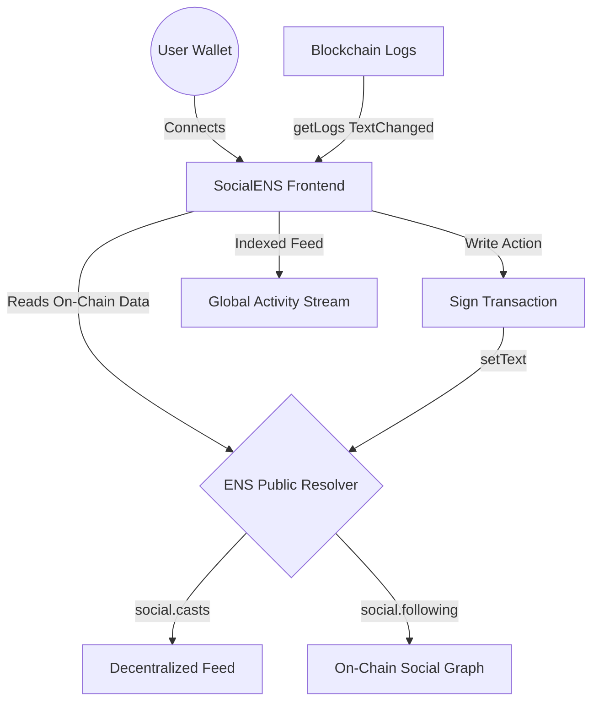

# 🌐 SocialENS

[](https://opensource.org/licenses/MIT)
[](https://nextjs.org/)
[](https://ens.domains/)
[](https://sepolia.app.ens.domains/)
[](#)
[](https://github.com/NikhilRaikwar/SocialENS)

**The First Truly Sovereign, Database-less Social Protocol.**

SocialENS is a decentralized micro-blogging platform where your social graph is owned 100% by you. By using the **Ethereum Name Service (ENS)** as a primary data store, we have eliminated the need for traditional databases, centralized servers, and private accounts. Every interaction is anchored to your `.eth` name, providing a level of censorship resistance and data portability previously impossible in web2 social media.

**Live Demo:** [https://socialens.nikhilraikwar.me/](https://socialens.nikhilraikwar.me/)
**Video Overview:** [https://youtu.be/eKA8zdpIGlw](https://youtu.be/eKA8zdpIGlw)

---

## 🚀 The Vision

Traditional social networks own your data, your followers, and your voice. They can de-platform you, shadow-ban your content, and sell your social graph to the highest bidder. **SocialENS flips the script.** 

Your `.eth` name is no longer just a pointer to a wallet address—it is now a portable social container that stores your entire digital legacy on-chain. Whether you use SocialENS, a mobile dapp, or a desktop client, your posts and followers are always with you because they live on the blockchain, not in a company's database.

### **Core Principles:**
- **Sovereign Identity**: Your profile is your ENS name. No emails, no passwords, just cryptographic ownership.
- **On-Chain Persistence**: Every post ("Cast") is anchored forever in the ENS Public Resolver text records.
- **Permissionless Social Graph**: Your follower list is a public, verifiable record on Ethereum that moves with you.
- **Database-less Architecture**: We don't use a backend. Real-time discovery is achieved by indexing blockchain logs in real-time.

---

## 🏗️ Architecture & Flow

SocialENS is built on a "Frontend-Only" stack. The logic for discovery, posting, and following happens entirely on the client-side by interacting with the Ethereum Sepolia network.



---

## 💎 ENS Hackathon Methodology

This project pushes the boundaries of how ENS can be used beyond simple naming.

### **1. Identity & Avatar Resolution**
We use `useEnsName` and `useEnsAvatar` to pull the user's canonical identity. If a user doesn't have an avatar set in their ENS metadata, we provide a consistent fallback using Vercel's avatar service, ensuring a beautiful UI for every on-chain citizen.

### **2. Storage (ENS Text Records)**
We utilize specific custom keys in the **ENS Public Resolver** (Sepolia) to store all social data:
- `social.casts`: Stores a JSON-encoded array of the most recent posts.
- `social.following`: Stores a JSON-encoded list of ENS names the user is following.
- `description`: We tap into the standard ENS bio record to ensure cross-app compatibility.
- `social.tipAmount`: A DeFi-enable record allowing users to set a "cost" for engagement or direct support.

### **3. Event-Driven Discovery**
To build the "Global Feed," we don't query a central indexer. Instead, we perform direct RPC calls to the Sepolia network to scan for `TextChanged` events. This allows the app to stay "live" and updated with the latest network activity without ever touching a centralized server.

---

## ✨ Key Features

- **Decentralized Tipping**: Support creators directly via their ENS name. Tips are sent instantly to the wallet linked to their `.eth` name.
- **On-Chain Discovery**: Find and follow new users directly from their blockchain activity via the "Discover Users" sidebar.
- **Real-Time Feed**: A high-performance stream of on-chain thoughts, anchored to real Ethereum identities.
- **Self-Sovereign Profiles**: Edit your bio and tipping preferences directly on-chain. No "Edit Profile" button on a server—just a transaction on the ledger.

---

## 🛠️ Open Source & Local Development

We believe in the power of open source. SocialENS is built on top of [Scaffold-ETH 2](https://scaffoldeth.io/) and is fully forkable.

### **Prerequisites**
- [Node.js (>= v20.18.3)](https://nodejs.org/)
- [Yarn](https://classic.yarnpkg.com/en/docs/install/)
- [Git](https://git-scm.com/downloads)

### **Getting Started**

1. **Clone the repository:**
```bash
git clone https://github.com/NikhilRaikwar/SocialENS.git
cd SocialENS
```

2. **Install dependencies:**
```bash
yarn install
```

3. **Configure your environment:**
Copy the example env file and add your Alchemy/Infura API keys.
```bash
cp packages/nextjs/.env.example packages/nextjs/.env.local
```

4. **Run the local development server:**
```bash
yarn start
```
Go to `http://localhost:3000` to see the app running locally.

5. **Build for production:**
```bash
yarn next:build
```

---

## 🗺️ Roadmap 2026

- **Q1 2026 (Launch)**: Official v1 launch for ETH HACK MONEY 2026.
- **Q2 2026**: Integration with Layer 2 ENS (Optimism/Base) for lower gas costs.
- **Q3 2026**: Decentralized media storage (IPFS/Arweave) for rich-text and image support.
- **Q4 2026**: Community-driven protocol standards for ENS social metadata.

---

## 🧪 Tech Stack

- **Scaffold-ETH 2**: Framework for rapid Ethereum development.
- **Next.js 15**: Modern React framework for the frontend.
- **Wagmi & Viem**: Core libraries for ENS resolution and contract interaction.
- **Tailwind CSS v4 & DaisyUI 5**: Professional "Indigo" design system.
- **Mermaid.js**: For architectural visualization.

---

Built with ❤️ by [Nikhil Raikwar](https://nikhilraikwar.me) for **ETH HACK MONEY 2026**.
