# 🌐 SocialENS

<div align="center">


**The First Fully Decentralized Social Network Powered by ENS Text Records**

[](https://scaffoldeth.io/)
[](https://ens.domains/)
[](https://sepolia.etherscan.io/)
[](https://nextjs.org/)
[](https://www.typescriptlang.org/)
[](LICENSE)

[Live Demo](#-quick-start) • [Video Demo](#-demo) • [Documentation](#-project-overview) • [Architecture](#-architecture)

---

### 🏆 ETH HACK MONEY 2026 Submission

**Prize Categories:**
- 🎉 **Integrate ENS** - $3,500 Pool Prize
- 🥇 **Most Creative Use of ENS for DeFi** - $1,500

</div>

---

## 📑 Table of Contents

- [✨ What is SocialENS?](#-what-is-socialens)
- [🎯 Problem Statement](#-problem-statement)
- [💡 Solution](#-solution)
- [🏗️ Architecture](#-architecture)
- [🔧 How It Works](#-how-it-works)
- [✨ Key Features](#-key-features)
- [🚀 Quick Start](#-quick-start)
- [🎬 Demo](#-demo)
- [📊 Tech Stack](#-tech-stack)
- [🗺️ Roadmap](#-roadmap)
- [🤝 Contributing](#-contributing)
- [📄 License](#-license)

---

## ✨ What is SocialENS?

SocialENS is a **revolutionary social networking platform** that stores all user data—profiles, posts, social graphs—directly in ENS text records on the Ethereum blockchain. No centralized servers, no databases, just pure Web3.

### Why This Matters

Traditional social media platforms:
- ❌ Own your data
- ❌ Can ban or censor you
- ❌ Lock you into their ecosystem
- ❌ Monetize your content without compensation

**SocialENS gives you:**
- ✅ **True Ownership** - Your ENS name, your data
- ✅ **Censorship Resistance** - No one can delete your posts
- ✅ **Portability** - Take your profile anywhere
- ✅ **Composability** - Other apps can build on your data
- ✅ **Monetization** - Direct creator tipping via ENS

---

## 🎯 Problem Statement

```mermaid
graph TD
    A[Current Social Media] --> B[Centralized Control]
    A --> C[Data Silos]
    A --> D[Platform Lock-in]
    A --> E[Censorship Risk]
    
    B --> F[❌ Users Have No Power]
    C --> F
    D --> F
    E --> F
    
    F --> G[Need for Decentralized Alternative]
    
    style A fill:#ff6b6b
    style F fill:#ee5a6f
    style G fill:#51cf66
```



**The Problem:**
1. **Data Ownership Crisis**: Your tweets, posts, connections belong to corporations
2. **Censorship**: Platforms can ban you, delete content arbitrarily  
3. **No Portability**: Can't take your followers to another platform
4. **Platform Risk**: Company fails → your data disappears
5. **Monetization Gap**: Platforms profit from your content, you don't

---

## 💡 Solution

SocialENS leverages ENS (Ethereum Name Service) text records as a **decentralized database** for social data:

```mermaid
graph LR
    A[Your ENS Name<br/>alice.eth] --> B[Text Records]
    B --> C[social.casts<br/>Your Posts]
    B --> D[social.following<br/>People You Follow]
    B --> E[description<br/>Your Bio]
    B --> F[avatar<br/>Profile Picture]
    
    C --> G[Stored On-Chain<br/>Forever]
    D --> G
    E --> G
    F --> G
    
    G --> H[🎉 You Own It<br/>Portable<br/>Censorship-Resistant]
    
    style A fill:#5f4bb6
    style B fill:#4c9aff
    style G fill:#10b981
    style H fill:#f59e0b
```



---

## 🏗️ Architecture

```mermaid
graph TB
    subgraph "User Layer"
        U1[👤 User with ENS Name]
        U2[📱 Web Interface]
    end
    
    subgraph "Application Layer"
        A1[Next.js 15 Frontend]
        A2[Wagmi v2 Hooks]
        A3[RainbowKit Wallet]
    end
    
    subgraph "Smart Contract Layer"
        S1[ENS Public Resolver<br/>0xE99...9b5]
        S2[setText Function]
        S3[text Function]
    end
    
    subgraph "Blockchain Layer"
        B1[Ethereum Sepolia Testnet]
        B2[ENS Text Records<br/>Immutable Storage]
    end
    
    subgraph "Discovery Layer"
        D1[TextChanged Events]
        D2[Event Logs Scanning]
        D3[User Discovery]
    end
    
    U1 --> U2
    U2 --> A1
    A1 --> A2
    A2 --> A3
    A3 --> S1
    
    S1 --> S2
    S1 --> S3
    S2 --> B2
    S3 --> B2
    
    B2 --> B1
    B1 --> D1
    D1 --> D2
    D2 --> D3
    D3 --> A1
    
    style U1 fill:#5f4bb6
    style S1 fill:#0ea5e9
    style B2 fill:#10b981
    style D3 fill:#f59e0b
```



---

## 🔧 How It Works

### 1️⃣ **ENS-Gated Access**

Only users with a Sepolia ENS name can access the platform. This ensures genuine Web3 identity verification.

**Implementation:**
```typescript
// EnsGuard.tsx - Protects all routes
const { data: ensName } = useEnsName({ 
  address, 
  chainId: 11155111 // Sepolia
});

if (!ensName) {
  return <LandingPage hasNoEns />; // Blocked
}

return <>{children}</>; // Access granted
```

---

### 2️⃣ **Creating Posts (Casts)**

All posts are stored as JSON arrays in the `social.casts` ENS text record. Each cast contains metadata including timestamp, author, and content.

**Code:**
```typescript
// Compose.tsx - Writing to ENS
const node = namehash(ensName);

// Read existing casts
const currentCasts = await publicClient.readContract({
  address: SEPOLIA_RESOLVER,
  abi: PUBLIC_RESOLVER_ABI,
  functionName: "text",
  args: [node, "social.casts"],
});

// Add new cast
const newCast = {
  id: Date.now(),
  text,
  timestamp: Date.now(),
  author: ensName,
};

const updatedCasts = [newCast, ...JSON.parse(currentCasts)];

// Write back to ENS
await writeContractAsync({
  address: SEPOLIA_RESOLVER,
  abi: PUBLIC_RESOLVER_ABI,
  functionName: "setText",
  args: [node, "social.casts", JSON.stringify(updatedCasts)],
});
```

---

### 3️⃣ **Feed Discovery**

Users are discovered by scanning blockchain events for `TextChanged` events on the ENS resolver contract. This creates a decentralized, permissionless discovery mechanism.

**Discovery Algorithm:**
```typescript
// Feed.tsx - Discovering users via events
const logs = await publicClient.getLogs({
  address: SEPOLIA_RESOLVER,
  event: parseAbiItem(
    "event TextChanged(bytes32 indexed node, string indexed indexedKey, string key, string value)"
  ),
  fromBlock: currentBlock - 1000n,
});

const castNodes = logs
  .filter(log => log.args.key === "social.casts")
  .map(log => log.args.node);

const uniqueNodes = Array.from(new Set(castNodes));

// Fetch casts from each discovered user
for (const node of uniqueNodes) {
  const castsJson = await publicClient.readContract({
    address: SEPOLIA_RESOLVER,
    functionName: "text",
    args: [node, "social.casts"],
  });
  // Add to feed...
}
```

---

### 4️⃣ **Following System**

The social graph is stored in the `social.following` text record as a JSON array of ENS names. This data is portable and controlled entirely by the user.

**Code:**
```typescript
// FollowButton.tsx
const handleFollow = async () => {
  const node = namehash(ensName);
  
  // Read current following list
  const followingJson = await publicClient.readContract({
    address: SEPOLIA_RESOLVER,
    functionName: "text",
    args: [node, "social.following"],
  });
  
  const following = JSON.parse(followingJson || "[]");
  
  // Toggle follow
  const updatedFollowing = isFollowing
    ? following.filter(f => f !== targetName)
    : [...following, targetName];
  
  // Write back to ENS
  await writeContractAsync({
    address: SEPOLIA_RESOLVER,
    functionName: "setText",
    args: [node, "social.following", JSON.stringify(updatedFollowing)],
  });
};
```

---

### 5️⃣ **Tipping Creators**

Creators can set their preferred tip amount in the `social.tipAmount` text record. Payments are sent directly to their ENS-resolved address.

**Code:**
```typescript
// CastCard.tsx - Tipping
const { data: preferredTip } = useEnsText({
  name: authorName,
  key: "social.tipAmount",
  chainId: 11155111,
});

const { data: authorAddress } = useEnsAddress({
  name: authorName,
  chainId: 11155111,
});

const handleTip = async () => {
  await sendTransactionAsync({
    to: authorAddress,
    value: parseEther(preferredTip || "0.001"),
  });
};
```

---

## ✨ Key Features

| Feature | Description | ENS Integration |
|---------|-------------|-----------------|
| 🔐 **ENS-Gated Access** | Only users with Sepolia ENS names can access | `useEnsName` hook validates ownership |
| 📝 **On-Chain Posts** | All posts stored in ENS text records forever | `setText("social.casts", JSON)` |
| 👥 **Decentralized Following** | Social graph stored in your ENS name | `setText("social.following", JSON)` |
| 👤 **Portable Profiles** | Profile data travels with your ENS name | `description`, `avatar` text records |
| 💰 **Native Tipping** | Tip creators directly via their ENS address | `useEnsAddress` for payments |
| 📡 **Event-Based Discovery** | Discover users via `TextChanged` events | `getLogs` with event filtering |
| 🎨 **Professional UI** | Modern, responsive design with Tailwind CSS | Glass morphism, gradients |
| 🚀 **Gas Optimized** | Batched reads, efficient writes | Array operations in single transaction |

---

## 🚀 Quick Start

### Prerequisites

Before you begin, ensure you have:

- ✅ **Node.js 18+** installed
- ✅ **Yarn** or **npm** package manager
- ✅ **MetaMask** or Web3 wallet
- ✅ **Sepolia ENS name** ([Register here](https://sepolia.app.ens.domains))
- ✅ **Sepolia testnet ETH** ([Faucet](https://cloud.google.com/application/web3/faucet/ethereum/sepolia))

### Installation Steps

```bash
# 1. Clone the repository
git clone https://github.com/YOUR_USERNAME/ens-farcaster.git
cd ens-farcaster

# 2. Install dependencies
yarn install

# 3. Set up environment variables
cp packages/nextjs/.env.example packages/nextjs/.env.local

# 4. Add your RPC URL (required)
# Edit packages/nextjs/.env.local:
NEXT_PUBLIC_SEPOLIA_RPC_URL=https://sepolia.infura.io/v3/YOUR_INFURA_KEY

# 5. Start the development server
yarn start
```

### Environment Configuration

Create `packages/nextjs/.env.local`:

```env
# Required: Sepolia RPC URL
NEXT_PUBLIC_SEPOLIA_RPC_URL=https://sepolia.infura.io/v3/YOUR_INFURA_KEY

# Optional: Alchemy API Key (backup RPC)
NEXT_PUBLIC_ALCHEMY_API_KEY=your_alchemy_key

# Optional: WalletConnect Project ID
NEXT_PUBLIC_WALLET_CONNECT_PROJECT_ID=your_project_id
```

### Deployment

```bash
# Build for production
yarn build

# Deploy to Vercel (recommended)
yarn vercel

# Or deploy to any hosting platform
yarn serve
```

---

## 🎬 Demo

### 📹 Video Demo
[🎥 **Watch the Full Demo Video**](YOUR_YOUTUBE_LINK)

### 🌐 Live Application
[🚀 **Try the Live App**](YOUR_VERCEL_LINK)

### 📸 Screenshots

<details>
<summary>Click to expand screenshots</summary>

#### Landing Page


#### Main Feed


#### User Profile


#### Profile Settings


</details>

---

## 📊 Tech Stack

### Core Technologies

| Technology | Version | Purpose |
|------------|---------|---------|
| **Next.js** | 15.2.8 | React framework with App Router |
| **React** | 19.2.3 | UI library |
| **TypeScript** | 5.8.2 | Type safety |
| **Wagmi** | 2.19.5 | React hooks for Ethereum |
| **Viem** | 2.39.0 | TypeScript Ethereum library |
| **RainbowKit** | 2.2.9 | Wallet connection UI |
| **Tailwind CSS** | 4.1.3 | Utility-first CSS framework |
| **DaisyUI** | 5.0.9 | Tailwind component library |
| **TanStack Query** | 5.59.15 | Data fetching & caching |
| **Scaffold-ETH 2** | Latest | Development framework |

### Blockchain

- **Network**: Ethereum Sepolia Testnet
- **ENS Protocol**: Text records for data storage
- **Smart Contract**: ENS Public Resolver (`0xE99638b40E4Fff0129D56f03b55b6bbC4BBE49b5`)

---

## 🗺️ Roadmap

### Phase 1: Genesis (Current) ✅

- [x] ENS-gated access
- [x] On-chain casts via text records
- [x] Decentralized feed discovery
- [x] Portable ENS profiles
- [x] Follow/unfollow functionality
- [x] User profile pages
- [x] Responsive UI design

### Phase 2: Social DeFi (Q2 2025) 🔜

- [ ] Native ETH tipping
- [ ] Token-gated premium content
- [ ] NFT profile badges
- [ ] Creator monetization via ENS subnames
- [ ] Subscription model
- [ ] Reputation tokens

### Phase 3: Multi-Chain Identity (Q3 2025) 🔮

- [ ] CCIP-Read for cross-chain resolution
- [ ] L2 subname support (Optimism, Base, Arbitrum)
- [ ] Gasless posting via account abstraction
- [ ] Multi-chain feed aggregation

### Phase 4: Decentralized Governance (Q4 2025) 🔮

- [ ] DAO-controlled content policies
- [ ] Community moderation tokens
- [ ] Open plugin architecture
- [ ] Governance proposals for features

### Phase 5: Global Scale (2026) 🔮

- [ ] ENS Namechain integration
- [ ] AI-powered content discovery
- [ ] Verified identity badges (Dentity)
- [ ] Interoperability with Lens Protocol
- [ ] Farcaster cross-posting
- [ ] Bluesky AT Protocol bridge

---

## 📁 Project Structure

```
ens-farcaster/
├── packages/
│   └── nextjs/
│       ├── app/                        # Next.js App Router
│       │   ├── page.tsx                # Main feed
│       │   ├── profile/page.tsx        # Profile settings
│       │   ├── [name]/page.tsx         # Dynamic user profiles
│       │   └── layout.tsx              # Root layout
│       │
│       ├── components/
│       │   └── ens-farcaster/          # Core components
│       │       ├── Compose.tsx         # Cast composition (ENS write)
│       │       ├── Feed.tsx            # Feed display (ENS read)
│       │       ├── CastCard.tsx        # Individual cast
│       │       ├── Sidebar.tsx         # User sidebar
│       │       ├── FollowButton.tsx    # Follow functionality
│       │       ├── EnsGuard.tsx        # ENS gating logic
│       │       ├── LandingPage.tsx     # Landing page
│       │       └── SuggestedUsers.tsx  # User discovery
│       │
│       ├── hooks/
│       │   └── scaffold-eth/           # Scaffold-ETH hooks
│       │       ├── useTransactor.tsx   # Transaction wrapper
│       │       ├── useTargetNetwork.ts # Network management
│       │       └── ...
│       │
│       ├── utils/
│       │   ├── ens.ts                  # ENS resolver ABI
│       │   └── scaffold-eth/           # Utilities
│       │
│       ├── styles/
│       │   └── globals.css             # Global styles
│       │
│       └── scaffold.config.ts          # Network config
│
├── README.md                           # This file
├── LICENSE                             # MIT License
└── package.json                        # Dependencies
```

---

## 🔑 Smart Contract Addresses

| Contract | Network | Address |
|----------|---------|---------|
| **ENS Public Resolver** | Sepolia | [`0xE99638b40E4Fff0129D56f03b55b6bbC4BBE49b5`](https://sepolia.etherscan.io/address/0xE99638b40E4Fff0129D56f03b55b6bbC4BBE49b5) |

### Contract Interface

```solidity
// ENS Public Resolver - Key Functions
interface IPublicResolver {
    // Write text record
    function setText(
        bytes32 node,
        string calldata key,
        string calldata value
    ) external;
    
    // Read text record
    function text(
        bytes32 node,
        string calldata key
    ) external view returns (string memory);
    
    // Event emitted on text change
    event TextChanged(
        bytes32 indexed node,
        string indexed indexedKey,
        string key,
        string value
    );
}
```

---

## 🎓 Learn More

### ENS Resources
- 📖 [ENS Documentation](https://docs.ens.domains)
- 🎥 [ENS Introduction Video](https://www.youtube.com/watch?v=pLDDbCZXvTE)
- 🛠️ [ENS Text Records Guide](https://docs.ens.domains/web/records)
- 🌐 [Register ENS on Sepolia](https://sepolia.app.ens.domains)

### Scaffold-ETH 2 Resources
- 📖 [Scaffold-ETH 2 Docs](https://scaffoldeth.io)
- 💬 [Telegram Community](https://t.me/+aLmF83si62ZhOGNh)
- 🐦 [Twitter Updates](https://twitter.com/scaffoldeth)

### Web3 Development
- 📘 [Wagmi Documentation](https://wagmi.sh)
- 📕 [Viem Documentation](https://viem.sh)
- 📙 [RainbowKit Docs](https://rainbowkit.com)
- 📗 [Next.js 15 Docs](https://nextjs.org/docs)

---

## 🤝 Contributing

We welcome contributions from the community! Here's how you can help:

### How to Contribute

1. **Fork the repository**
   ```bash
   git fork https://github.com/YOUR_USERNAME/ens-farcaster.git
   ```

2. **Create a feature branch**
   ```bash
   git checkout -b feature/amazing-feature
   ```

3. **Make your changes**
   - Follow the existing code style
   - Add tests if applicable
   - Update documentation

4. **Commit your changes**
   ```bash
   git commit -m 'Add amazing feature'
   ```

5. **Push to the branch**
   ```bash
   git push origin feature/amazing-feature
   ```

6. **Open a Pull Request**

### Development Guidelines

- ✅ Use TypeScript for type safety
- ✅ Follow React best practices
- ✅ Write clear commit messages
- ✅ Test on Sepolia testnet before submitting
- ✅ Update README if adding new features

### Code Style

```bash
# Format code
yarn format

# Check types
yarn check-types

# Lint
yarn lint
```

---

## 🐛 Troubleshooting

<details>
<summary><b>Issue: Can't write to ENS records</b></summary>

**Solution:**
- Ensure you own the ENS name you're trying to write to
- Make sure you're connected to Sepolia network
- Check that you have enough Sepolia ETH for gas
- Verify the resolver address is correct

</details>

<details>
<summary><b>Issue: Text records not updating</b></summary>

**Solution:**
- Wait for transaction confirmation (check Etherscan)
- Clear browser cache and reload
- Try reading from a different RPC endpoint
- Ensure chainId is set to 11155111 (Sepolia)

</details>

<details>
<summary><b>Issue: Avatar not loading</b></summary>

**Solution:**
- ENS avatar should be set via ENS Manager
- Fallback avatars are generated automatically
- Check IPFS gateway accessibility
- Use `https://avatar.vercel.sh/[name]` as fallback

</details>

<details>
<summary><b>Issue: Feed not showing posts</b></summary>

**Solution:**
- Verify you have an ENS name on Sepolia
- Check RPC connection in console
- Try refreshing with the refresh button
- Ensure Sepolia RPC URL is set in `.env.local`

</details>

---

## 📊 Performance & Gas Optimization

### Gas Costs (Sepolia Testnet)

| Operation | Estimated Gas | Cost (at 1 gwei) |
|-----------|--------------|------------------|
| Post first cast | ~80,000 gas | $0.00008 ETH |
| Post additional cast | ~50,000 gas | $0.00005 ETH |
| Follow user | ~45,000 gas | $0.000045 ETH |
| Update bio | ~30,000 gas | $0.00003 ETH |

### Optimization Strategies

1. **Batched Reads**: Read multiple text records in single call
2. **Cached Data**: Use TanStack Query for caching
3. **Event Indexing**: Efficient user discovery via logs
4. **Lazy Loading**: Load feed progressively
5. **Compressed JSON**: Minify JSON before storing

---

## 🔒 Security

### Best Practices Implemented

- ✅ **ENS Ownership Verification**: Only owner can update records
- ✅ **Client-Side Validation**: Input sanitization
- ✅ **Rate Limiting**: Prevent spam (via gas costs)
- ✅ **Secure RPC**: Use trusted RPC providers
- ✅ **No Private Keys in Code**: Use wallet providers

### Security Considerations

⚠️ **Important Notes:**
- This is a testnet demo - do NOT use with real funds on mainnet
- ENS text records are PUBLIC - don't store sensitive data
- Always verify ENS ownership before updating records
- Use hardware wallets for mainnet deployment

---

## 📄 License

This project is licensed under the **MIT License** - see the [LICENSE](LICENSE) file for details.

```
MIT License

Copyright (c) 2025 SocialENS Team

Permission is hereby granted, free of charge, to any person obtaining a copy
of this software and associated documentation files (the "Software"), to deal
in the Software without restriction...
```

---

## 🙏 Acknowledgments

We'd like to thank the following projects and communities:

- 🌐 **[ENS Domains](https://ens.domains/)** - For the incredible naming infrastructure
- 🏗️ **[Scaffold-ETH 2](https://scaffoldeth.io/)** - For the amazing development framework
- 🟣 **[Farcaster](https://farcaster.xyz/)** - For UI/UX inspiration
- 🌈 **[RainbowKit](https://rainbowkit.com/)** - For beautiful wallet connections
- 🔷 **[Wagmi](https://wagmi.sh/)** - For powerful React hooks
- 🏆 **[ETHGlobal](https://ethglobal.com/)** - For hosting amazing hackathons

### Special Thanks

- Vitalik Buterin for Ethereum
- Nick Johnson for ENS
- The entire Ethereum community
- All open-source contributors

---

## 📞 Contact & Support

- 🐦 **Twitter**: [@socialens](https://twitter.com/socialens)
- 💬 **Telegram**: [Join Community](https://t.me/socialens)
- 📧 **Email**: hello@socialens.eth
- 🐛 **Issues**: [GitHub Issues](https://github.com/YOUR_USERNAME/ens-farcaster/issues)
- 💡 **Discussions**: [GitHub Discussions](https://github.com/YOUR_USERNAME/ens-farcaster/discussions)

---

## 🌟 Star History

[](https://star-history.com/#YOUR_USERNAME/ens-farcaster&Date)

---

<div align="center">

### Built with ❤️ for ETH HACK MONEY 2026

[](https://ens.domains/)
[](https://sepolia.etherscan.io/)
[](https://scaffoldeth.io/)

**[🌟 Star this repo](https://github.com/YOUR_USERNAME/ens-farcaster) • [🐦 Follow us](https://twitter.com/socialens) • [📖 Read the docs](https://docs.socialens.eth)**

---

*"The future of social media is decentralized, permissionless, and powered by ENS."*

</div>
